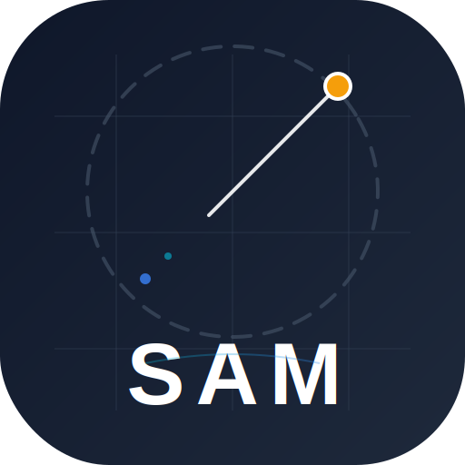

# Orion System | Engineering & Design




> **Navigate your Value.**

Orion is a modern, high-performance **Personal Knowledge Management (PKM)** and **Digital Garden** system. It combines a public-facing portfolio and blog with a sophisticated, encrypted private dashboard ("Captain's Cabin") for managing personal data, health, and AI interactions.

Designed with **Atomic Design principles**, powered by **React 19**, and orchestrated via **pnpm** monorepo-style management.

## 🌟 Key Features

### 1. Public Sector (The Bridge)

- **Interactive Hero:** Dynamic 3D-style CSS animations and status indicators.
- **Transmission Log (Blog):** Markdown-supported journal with tagging, search, and nested comments. Supports embedded iframes and rich media.
- **Portfolio & Resume:** A dual-mode showcase (Resume Document / Project Cards) with multi-language support (EN/ZH).
- **AI Agents:**
  - **Thinking Agent:** Leveraging Gemini 3.0 Pro for complex reasoning tasks.
  - **Live Agent:** Real-time multimodal (audio/video) communication interface.

### 2. Captain's Cabin (Private Space)

A restricted area protected by JWT authentication and Role-Based Access Control (RBAC).

#### 🧠 Second Brain (AI Core)

- **Context-Aware Chat:** RAG-style interactions having access to your journals, fitness logs, and project data.
- **Multimodal Input:** Drag-and-drop image analysis and text processing.
- **Session Management:** Persistent chat history with sidebar navigation.

#### 🏃 Fitness Space

- **Holistic Tracking:** Weight, BMI, sleep, mood, and water intake logging.
- **Workout Log:** Track activity types (Run, Lift, HIIT, etc.) with duration and notes.
- **Photo Wall:** A monthly calendar-based gallery for progress photos.
- **Analytics:** Visual charts using Recharts for weight trends and activity stats.

#### 🧘 Leisure & Utilities

- **AI Smart Kitchen:** - **Chef's Wheel:** Randomized meal decision maker with filters (Healthy/Variety).
  - **Smart Plan:** AI-generated meal plans based on your fitness goals (Cut/Bulk).
- **Moon Cycle:** Period and biological cycle tracker with predictions.
- **Pirate Lords:** A custom logic puzzle game (Slider/Grid strategy).

#### 🗺️ Footprint & Gallery

- **Star Map:** Dual-view (China/Global) travel logging via ECharts & Leaflet.
- **Capsule Gallery:** Corkboard UI with Draggable, rotatable photo cards.

## 🛠 Tech Stack & Engineering

### Core

- **Framework:** React 19
- **Build Tool:** Vite
- **Language:** TypeScript
- **Package Manager:** **pnpm** (Strict mode)

### Infrastructure & Quality

- **Linting:** ESLint v9 (Flat Config)
- **Formatting:** Prettier
- **Git Hooks:** Husky + Lint-staged (Automated pre-commit checks)
- **CI/CD:** Automated Service Worker versioning

### Libraries

- **Styling:** Tailwind CSS, FontAwesome
- **AI:** @google/genai SDK (Gemini 3 Pro, Flash 2.5)
- **Visualization:** Recharts, ECharts, Leaflet
- **Real-time:** Socket.io-client

## 🚀 Getting Started

### Prerequisites

- **Node.js**: v22.0.0 or higher
- **pnpm**: v9+ (Recommended via Corepack)

### Installation

1. **Clone and Setup**

   ```bash
   git clone [https://github.com/yourusername/orion.git](https://github.com/yourusername/orion.git)
   cd orion

   # Enable pnpm via Node Corepack
   corepack enable
   corepack prepare pnpm@latest --activate
   ```

````

2. **Install Dependencies**
```bash
pnpm install

````

3. **Environment Configuration**
   Create a `.env` file in the root directory:

```properties
VITE_API_URL=http://localhost:5000/api
VITE_GEMINI_API_KEY=your_key_here
VITE_CLOUDINARY_CLOUD_NAME=your_cloud_name

```

4. **Run Development Server**

```bash
pnpm dev

```

## 🤖 Automation & PWA

This project uses **Husky** to enforce code quality and automate PWA versioning.

### Service Worker Strategy

- **Entry (HTML):** Network First (Prevents version deadlocks).
- **Assets (JS/CSS):** Cache First (Stale-while-revalidate).
- **API:** Network Only.

### Auto-Bumping

Every time you commit code, a `pre-commit` hook triggers:

1. Runs `scripts/bump-sw.js` to update the cache version timestamp in `sw.js`.
2. Runs `ESLint` and `Prettier` to fix code style.
3. Adds the updated Service Worker back to the commit.

## 🎨 Theming

The system features a dynamic **Cosmic/Scenic** theme engine:

- **Light Mode:** "Milky" warm tones with paper textures.
- **Dark Mode:** Deep space "Cosmic" theme with animated starfields.
- **Holiday Modes:** Special overlays (Snow/Lanterns) triggered by date.

## 📄 License

[MIT](https://www.google.com/search?q=LICENSE)
